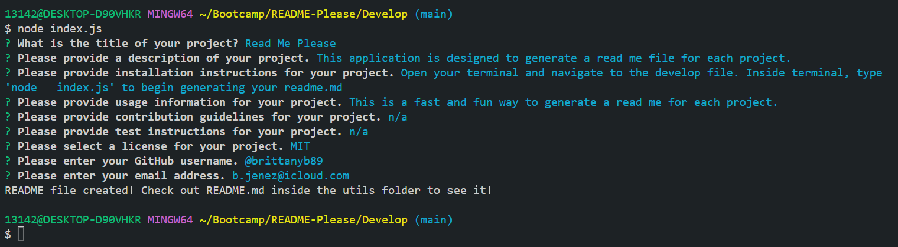
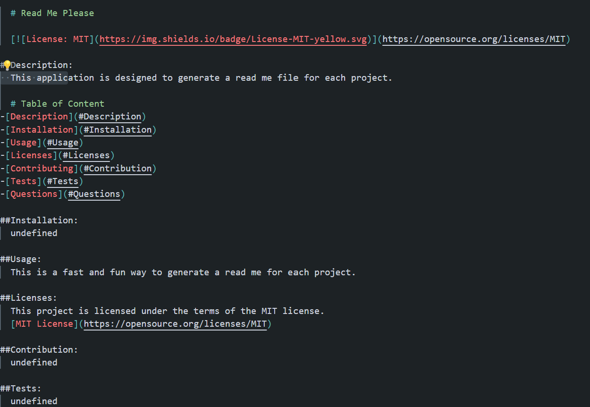
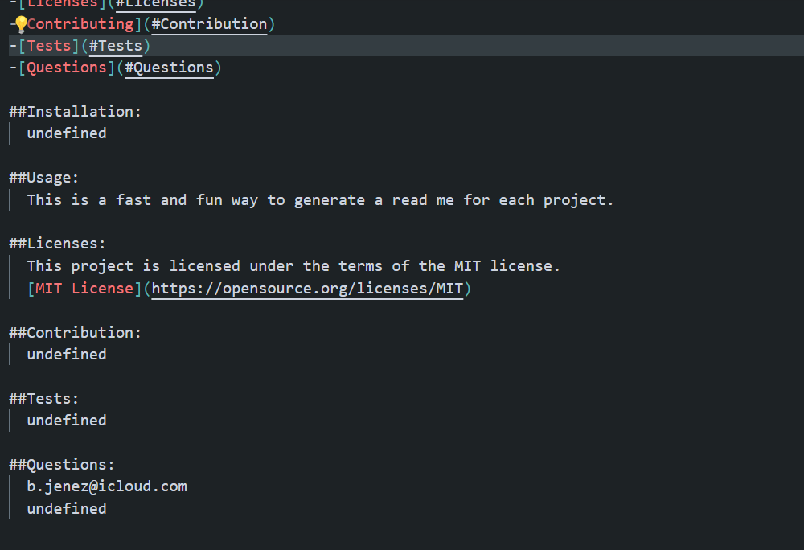

# README-Please

     

## Description

Developer created this project to demonstrate abilities to create a professional README file using Nodejs. This project was built to display another way of creating a README file quickly without having to enter it by typing into a file. Rather, this technique would allow the user to enter their information into the terminal and create the README that can be viewed inside the browser for new projects. In creating this project, I learned the useful ways of using Node to create a README file generator.

## Table of Contents

- [Installation](#installation)
- [Usage](#usage)
- [Contributing](#contributing)
- [Tests](#tests)
- [Questions](#questions)
- [Credits](#credits)
- [License](#license)

## Installation

Walk-through video: https://watch.screencastify.com/v/gC57aVm6ROXD1PpW8C5X

GitHub URL: https://github.com/brittanyb89/README-PleaseLinks to an external site.

Sample README: C:\Users\13142\Bootcamp\README-Please\Develop\sample.md

## Usage

Open new terminal and navigate to 'develop' folder

Type 'node index.js' into terminal

Answer the following questions as they are prompted to the best of your ability. It's ok to use 'N/A' for the ones that are not applicable.

After you are finished answering the final question, you will get a message alerting you that the README.md file is generated.

## Contributing

If you created an application or package and would like other developers to contribute it, you can include guidelines for how to do so. The [Contributor Covenant](https://www.contributor-covenant.org/) is an industry standard, but you can always write your own if you'd prefer.

## License

MIT License

Copyright (c) 2022 Brittany Burton

Permission is hereby granted, free of charge, to any person obtaining a copy of this software and associated documentation files (the "Software"), to deal in the Software without restriction, including without limitation the rights to use, copy, modify, merge, publish, distribute, sublicense, and/or sell copies of the Software, and to permit persons to whom the Software is furnished to do so, subject to the following conditions:

The above copyright notice and this permission notice shall be included in all copies or substantial portions of the Software.

THE SOFTWARE IS PROVIDED "AS IS", WITHOUT WARRANTY OF ANY KIND, EXPRESS OR IMPLIED, INCLUDING BUT NOT LIMITED TO THE WARRANTIES OF MERCHANTABILITY, FITNESS FOR A PARTICULAR PURPOSE AND NONINFRINGEMENT. IN NO EVENT SHALL THE AUTHORS OR COPYRIGHT HOLDERS BE LIABLE FOR ANY CLAIM, DAMAGES OR OTHER LIABILITY, WHETHER IN AN ACTION OF CONTRACT, TORT OR OTHERWISE, ARISING FROM, OUT OF OR IN CONNECTION WITH THE SOFTWARE OR THE USE OR OTHER DEALINGS IN THE SOFTWARE.

---
